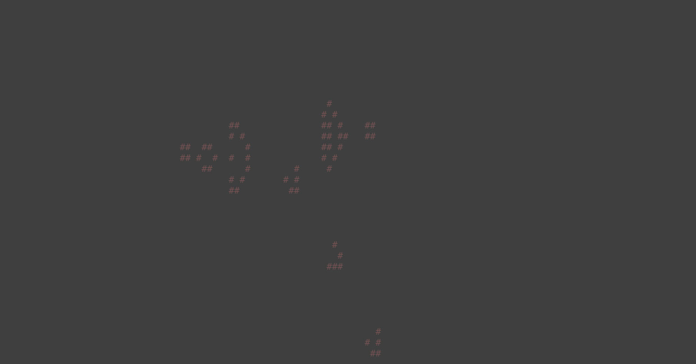
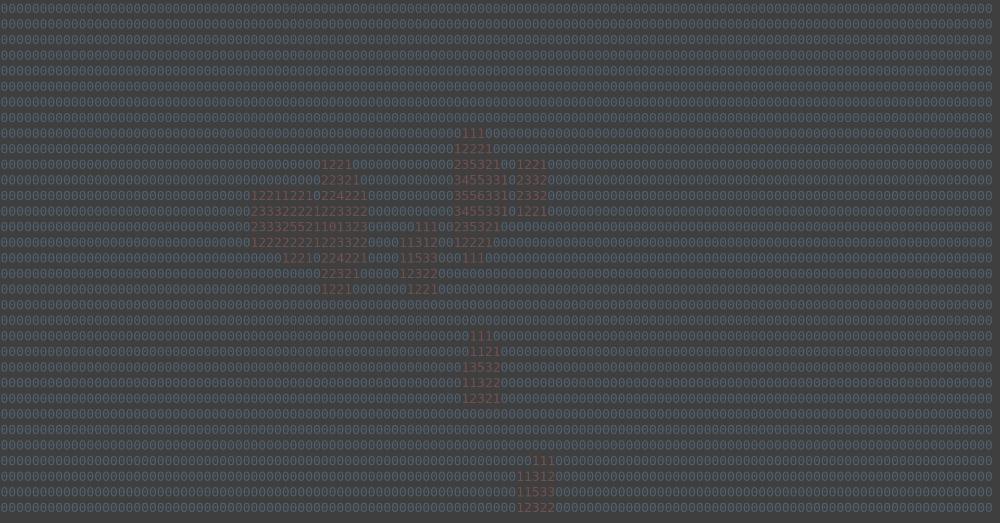

# conwaygo

Conway's Game of Life implementation


## Usage
```bash
$ go build conway.go
$ ./conway -h
Usage of ./conway:
  -debug
      Display in debug mode
  -delay float
      Seconds between updates (default 0.2)
```

When the binary in run, you will be presented with a blank screen.  
Click on the terminal where you wish the seed live cells. You can do this at anytime, even after you have started the simulation.


### Keybindings
| Key         | Description                          |
| ----------- | ------------------------------------ |
| `space`     | Start and stop the simulation        |
| `Page Up`   | Increase the speed of the simulation |
| `Page Down` | Decrease the spped of the simulation |
| `ctrl`+`d`  | Enable debug mode.                   |
| arrow keys  | Move the viewport                    | 

In debug mode instead of displaying live cells, each tile will show the number living cells surrounding it.

## Example


